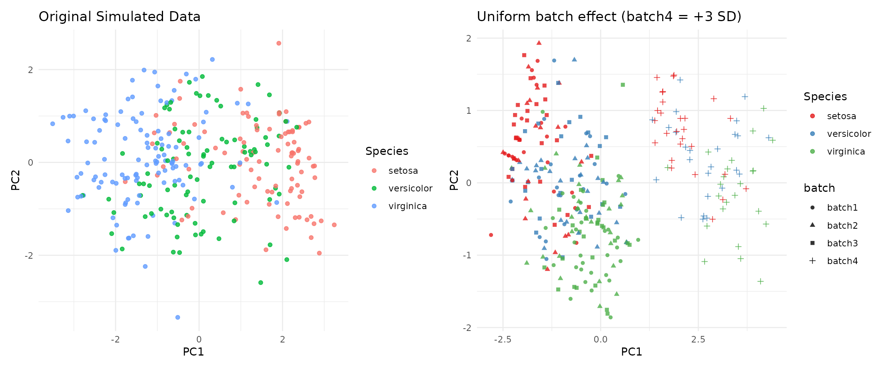

# Batch & group effects

Two post-processors stamp designed structure onto an already-clean
synthetic dataset (a `data.frame` or a `synthetica_sim`). They share the
same additive, SD-unit shift mechanism but model different things:

- [`add_batch_effect()`](https://hughesevoanth.github.io/synthetica/reference/add_batch_effect.md)
  – a *technical / nuisance* batch factor (the “which plate was this run
  on” structure), for stress-testing batch-correction.
- [`add_group_effect()`](https://hughesevoanth.github.io/synthetica/reference/add_group_effect.md)
  – a *designed biological* grouping factor whose levels are genuinely
  **nominal** (each perturbs its own features in its own way).

We start from a baseline synthetic `iris`:

``` r

syn <- simulate_dataset(iris, n = 300, seed = 42, verbose = FALSE)
```

## Technical batch effects

### Uniform shifts: the outlier-plate scenario

`shifts` as a numeric vector of length `n_batches` moves *every* target
feature in a batch by the same SD-multiple. Here three batches are
indistinguishable and the fourth is shifted hard – the classic outlier
plate:

``` r

batched <- add_batch_effect(syn, n_batches = 4,
                            shifts = c(0, 0, 0, 3), seed = 42)
table(batched$data$batch)
#> 
#> batch1 batch2 batch3 batch4 
#>     75     75     75     75
```

``` r

## syn data PCA 
num_syn <- syn$data[, vapply(syn$data, is.numeric, logical(1))]
pca_syn <- prcomp(num_syn, scale. = TRUE)$x

df_syn <- data.frame(pca_syn, Species = syn$data$Species)

p1 = ggplot(df_syn, aes(x = PC1, y = PC2, color = Species)) +
  geom_point(alpha = 0.8) +
  labs(title = "Original Simulated Data") +
  theme_minimal()

### batched data PCA 
num_batched <- batched$data[, vapply(batched$data, is.numeric, logical(1))]
pca_batched <- prcomp(num_batched, scale. = TRUE)$x

df_batched <- data.frame(pca_batched, batch = batched$data$batch, Species = batched$data$Species)

p2 = ggplot(df_batched, aes(x = PC1, y = PC2, color = Species, shape = batch)) +
  geom_point(alpha = 0.8) +
  labs(title = "Uniform batch effect (batch4 = +3 SD)",
       x = "PC1", y = "PC2") +
  theme_minimal() +
  scale_color_brewer(palette = "Set1") # Clean, distinct colors for your 4 batches

p1 | p2
```



### Spike-and-slab: realistic heterogeneous shifts

Real batch effects do not hit every feature equally.
`shifts = "spike_slab"` draws a per-feature shift for each batch –
`hit ~ Bernoulli(shift_prob)` then `N(0, shift_sd)` – leaving a clean
`reference_batch`. `proportions` gives unequal batch sizes. This is the
realistic ’omics signature and scales to wide matrices.

``` r

batched_ss <- add_batch_effect(
  syn, 
  n_batches = 4, 
  shifts = "spike_slab",
  shift_prob = 0.5, # per feature probability being shifted
  shift_sd = 1, # the SD shift
  proportions = c(0.4, 0.3, 0.2, 0.1), # relative size of each batch; sums to 1
  reference_batch = 1, 
  seed = 6
)

cat("Batch sizes\n")
#> Batch sizes
table(batched_ss$data$batch)                       # unequal sizes
#> 
#> batch1 batch2 batch3 batch4 
#>    120     90     60     30
cat("\nSift Matrix: Batch by featuer in SD units of shift from reference\n\n")
#> 
#> Sift Matrix: Batch by featuer in SD units of shift from reference
round(batched_ss$batch_effect$shift_matrix, 2)     # ground-truth shifts (row 1 = clean)
#>        Sepal.Length Sepal.Width Petal.Length Petal.Width
#> batch1         0.00        0.00         0.00        0.00
#> batch2         0.00        0.00         0.74       -0.11
#> batch3         0.00       -0.59         0.00        0.29
#> batch4         0.07       -0.81         0.00       -0.27
```

The recorded `shift_matrix` is the ground truth: hand the batched data
to a correction method and check how well it recovers the unshifted
values.

## Designed group effects (nominal)

[`add_group_effect()`](https://hughesevoanth.github.io/synthetica/reference/add_group_effect.md)
adds a named grouping factor whose levels move different features in
different directions – a genuinely nominal factor that the single-latent
copula could not produce (categorical phenotype injection can only do an
*ordinal* gradient). Two ways to specify the effect.

### Explicit: hand-tuned, non-monotone

A named list keyed by level, each a named numeric of per-feature shifts
(SD units). Omitted level = reference; omitted feature = 0. Here clay
has small petals while silt has wide sepals – two different features, no
ordering:

``` r

g <- add_group_effect(
  syn, name = "soil", levels = c("clay", "sand", "silt"),
  probs = c(0.5, 0.3, 0.2), # relative size of each batch; sums to 1
  effects = list(clay = c(Petal.Length = -0.9),
                 silt = c(Sepal.Width  =  1.0)),
  seed = 3
)

cat("Median Petal Length by Soil type\n")
#> Median Petal Length by Soil type
tapply(g$data$Petal.Length, g$data$soil, median)   # clay is low
#>    clay    sand    silt 
#> 2.89773 4.50000 4.50000
cat("\nMedian Sepal Width by Soil type\n")
#> 
#> Median Sepal Width by Soil type
tapply(g$data$Sepal.Width,  g$data$soil, median)   # silt is high
#>     clay     sand     silt 
#> 3.000000 3.000000 3.420095
```

### Generative: scales to ’omics widths

A named-list matrix is infeasible for an 11,000-feature panel. The
generative mode says “each level perturbs a *proportion* of features at
some *effect-size distribution*” – spike-and-slab drawn independently
per level, so each level gets its own random signature:

``` r

## Generate a fake omics data set
omics <- as.data.frame(matrix(rnorm(300 * 500), 300, 500,
                              dimnames = list(NULL, paste0("p", 1:500))))

## Define a new variable `tissue` and add group effects
gg <- add_group_effect(
  omics, name = "tissue", 
  levels = c("liver", "muscle", "fat"),
  probs = c(0.5, 0.3, 0.2), # relative size of each batch; sums to 1
  effect_prop = 0.10, ## probability that a feature is effected
  effect_sd = 0.5, 
  seed = 42
)

## Number of features effected by each level
cat("Number of features influenced by each feature:\n")
#> Number of features influenced by each feature:
rowSums( attr(gg, "group_effect")$shift_matrix != 0)   # ~50 of 500 features per level
#>  liver muscle    fat 
#>     56     50     49
```

Because each level draws its own random subset, the perturbed feature
*sets* barely overlap between levels – the defining property of a
nominal factor. Affected feature marginals become mixtures across
groups, which is intended: the group genuinely changes the distribution.
