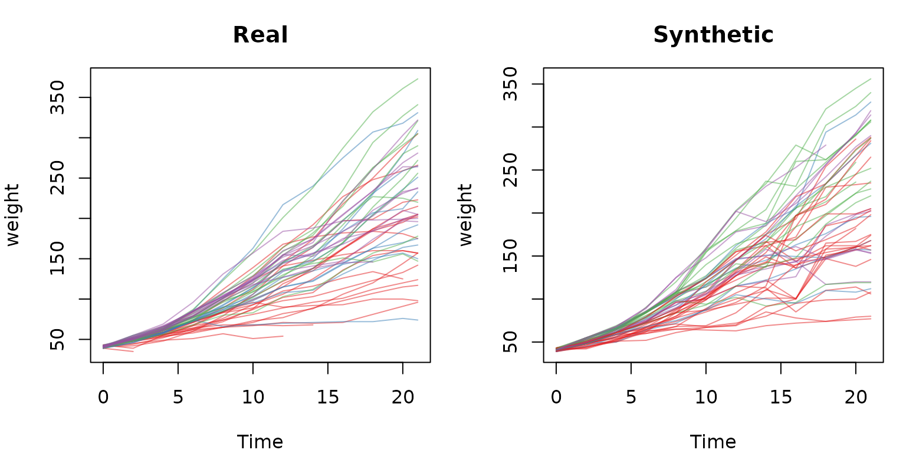

# Longitudinal data (repeated measures)

## Repeated measures via wide-format

A plain copula treats every row as independent, which is wrong for
repeated measures: a subject’s value at one timepoint is correlated with
its value at the next.
[`simulate_longitudinal()`](https://hughesevoanth.github.io/synthetica/reference/simulate_longitudinal.md)
handles this by reshaping to **wide** format (one row per subject, a
column per `feature x time`), reusing
[`simulate_dataset()`](https://hughesevoanth.github.io/synthetica/reference/simulate_dataset.md),
and reshaping back. You just name the `id` and `time` columns.

This turns within-subject temporal autocorrelation into ordinary
between-column correlation, so everything applies for free:
per-timepoint marginals capture the trajectory shape (e.g. growth), the
missingness model reproduces dropout, and time-invariant covariates ride
along as single columns.

### ChickWeight

[`datasets::ChickWeight`](https://rdrr.io/r/datasets/ChickWeight.html)
is 50 chicks weighed over 12 timepoints, with a time-invariant `Diet`:

``` r

data(ChickWeight)
sim <- simulate_longitudinal(ChickWeight, id = "Chick", time = "Time",
                             seed = 1, verbose = FALSE)

class(sim)        # "synthetica_long"
#> [1] "synthetica_long"
sim$static        # "Diet" auto-detected (constant within Chick)
#> [1] "Diet"
sim$features      # "weight" (time-varying)
#> [1] "weight"
head(sim$data)
#>   weight Time Chick Diet
#> 1     43    0 subj1    1
#> 2     51    2 subj1    1
#> 3     61    4 subj1    1
#> 4     72    6 subj1    1
#> 5     84    8 subj1    1
#> 6     87   10 subj1    1
```

#### The growth curve is preserved

Each timepoint has its own marginal, so the mean trajectory emerges
automatically:

``` r

data.frame(
  Time = sort(unique(ChickWeight$Time)),
  real = round(tapply(ChickWeight$weight,    ChickWeight$Time, mean), 1),
  syn  = round(tapply(sim$data$weight, sim$data$Time, mean), 1)
) |>
  kable(caption = "Mean weight by timepoint: real vs synthetic") |>
  kable_styling(full_width = FALSE, font_size = 11)
```

|     | Time |  real |   syn |
|:----|-----:|------:|------:|
| 0   |    0 |  41.1 |  41.1 |
| 2   |    2 |  49.2 |  49.7 |
| 4   |    4 |  60.0 |  60.8 |
| 6   |    6 |  74.3 |  74.9 |
| 8   |    8 |  91.2 |  92.7 |
| 10  |   10 | 107.8 | 110.8 |
| 12  |   12 | 129.2 | 134.2 |
| 14  |   14 | 143.8 | 151.3 |
| 16  |   16 | 168.1 | 164.2 |
| 18  |   18 | 190.2 | 191.3 |
| 20  |   20 | 209.7 | 210.7 |
| 21  |   21 | 218.7 | 214.6 |

Mean weight by timepoint: real vs synthetic {.table .table
style="font-size: 11px; width: auto !important; margin-left: auto; margin-right: auto;"}

#### Trajectories look like growth, not noise

``` r

op <- par(mfrow = c(1, 2), mar = c(4, 4, 3, 1))
cols <- c("#E41A1C", "#377EB8", "#4DAF4A", "#984EA3")
spaghetti <- function(df, title) {
  plot(NA, xlim = range(df$Time), ylim = range(df$weight, na.rm = TRUE),
       xlab = "Time", ylab = "weight", main = title)
  for (ch in unique(df$Chick)) {
    d <- df[df$Chick == ch, ]
    lines(d$Time, d$weight, col = adjustcolor(cols[as.integer(d$Diet)[1]], 0.5))
  }
}
spaghetti(ChickWeight, "Real")
spaghetti(sim$data,    "Synthetic")
```



``` r

par(op)
```

#### Within-subject correlation is preserved

The point of the wide-format trick is that a subject’s weights across
time stay coupled. Compare the day-0 vs day-20 correlation, aligned by
chick:

``` r

pair_cor <- function(df, t0, t1) {
  a <- df[df$Time == t0, c("Chick", "weight")]
  b <- df[df$Time == t1, c("Chick", "weight")]
  m <- merge(a, b, by = "Chick")
  cor(m[[2]], m[[3]], use = "complete.obs")
}
c(real = round(pair_cor(ChickWeight, 0, 20), 3),
  syn  = round(pair_cor(sim$data,    0, 20), 3))
#>   real    syn 
#> -0.320 -0.354
```

Chicks that died early reproduce as realistic **dropout** –
`(subject, time)` rows with no observed feature are absent from the
synthetic long output, just as in the input.

### Other designs

The same recipe covers:

- **Before/after RCTs** – two timepoints become `baseline` / `followup`
  columns; the pre-post correlation and any treatment shift are
  preserved.
- **Crossover trials** – one column per period.
- **Modest biomarker panels** – a handful of analytes over several
  visits.

### Scope

The wide frame has `features x timepoints` columns, so this approach is
for the tractable regime (up to a few hundred such columns); a warning
fires beyond that. High-dimensional longitudinal ’omics (thousands of
features x several timepoints) needs a different method – subject-level
random effects with an autoregressive temporal residual structure – and
is out of scope here. The time grid is the set of unique observed time
values, so genuinely irregular or continuous times should be binned to a
common grid before calling.
