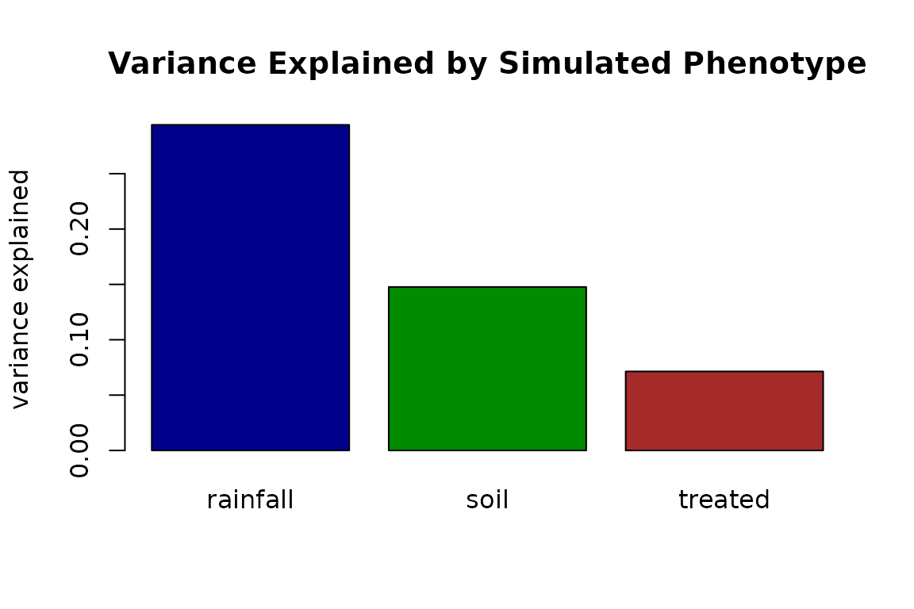
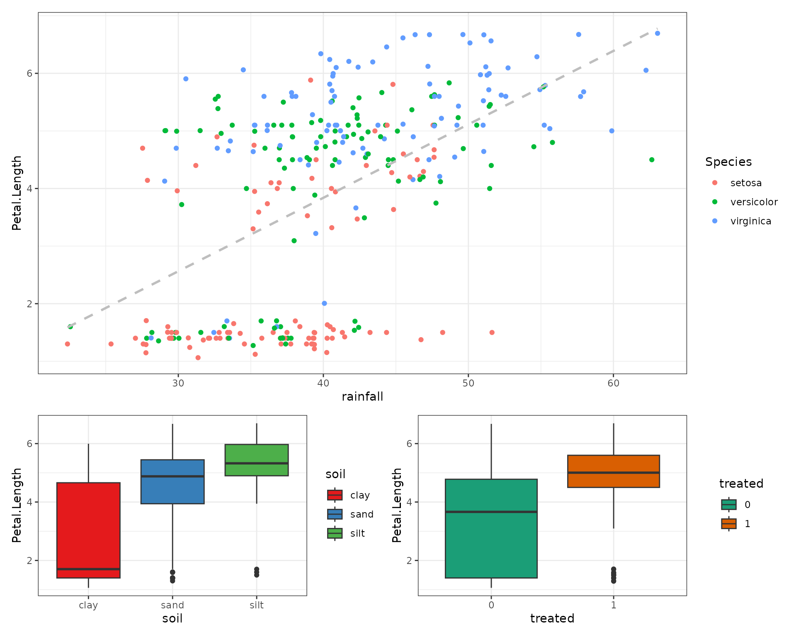

# Injecting phenotypes

## Inject a synthetic phenotype

Beyond reproducing the input,
[`simulate_dataset()`](https://hughesevoanth.github.io/synthetica/reference/simulate_dataset.md)
can **append new synthetic columns** – *phenotypes* – each correlated
with a chosen subset of features at a user-defined effect size. This is
useful for generating teaching datasets, power analyses, or method
benchmarks with a known ground-truth signal.

Each entry of `inject` is a named list describing the trait. The
`effect` controls how strongly it correlates with its `on` targets,
either as a standardized `mean_shift` or a target `r_squared` on the
latent scale. Three phenotype `type`s are supported: `"quantitative"`,
`"binary"`, and `"categorical"`.

``` r

sim <- simulate_dataset(
  iris, n = 300, seed = 42, verbose = FALSE,
  inject = list(
    # 1. continuous trait, modest effect on every feature
    rainfall = list(
      type   = "quantitative", mean = 40, sd = 8,
      effect = list(kind = "r_squared", min_r2 = 0.35, on = "all")
    ),
    # 2. binary trait (case/control), stronger effect on the petals
    treated = list(
      type   = "binary", prob = 0.40,
      effect = list(kind = "r_squared", min_r2 = 0.3,
                    on = c("Petal.Length", "Petal.Width"))
    ),
    # 3. ordinal categorical trait: clay -> sand -> silt gradient
    soil = list(
      type   = "categorical",
      levels = c("clay", "sand", "silt"), probs = c(0.5, 0.3, 0.2),
      effect = list(kind = "r_squared", min_r2 = 0.3,
                    on = c("Petal.Length", "Petal.Width"))
    )
  )
)
#> Warning in .attach_phenotypes(data, types, inject, verbose): phenotype
#> 'rainfall': dropped 1 categorical target(s) -- not supported as effect targets
#> in v1
#> Warning in .generate_phenotype(s, X_target, target_corr): phenotype effect
#> infeasible: requested |corr| mean 0.592, clipped to 0.590

head(sim$data, 6) |>
  kable(digits = 2, caption = "iris + three injected phenotypes") |>
  kable_styling(full_width = FALSE, font_size = 11)
```

| Sepal.Length | Sepal.Width | Petal.Length | Petal.Width | Species | rainfall | treated | soil |
|---:|---:|---:|---:|:---|---:|---:|:---|
| 6.0 | 3.8 | 4.60 | 1.3 | setosa | 45.52 | 0 | clay |
| 4.8 | 3.0 | 1.37 | 0.2 | setosa | 31.72 | 0 | clay |
| 5.6 | 2.8 | 1.50 | 1.5 | setosa | 32.82 | 0 | clay |
| 6.3 | 3.0 | 4.50 | 1.6 | versicolor | 40.81 | 1 | sand |
| 5.0 | 3.0 | 1.50 | 0.3 | setosa | 33.40 | 0 | clay |
| 5.0 | 3.0 | 1.70 | 1.4 | setosa | 38.07 | 0 | silt |

iris + three injected phenotypes {.table .table
style="font-size: 11px; width: auto !important; margin-left: auto; margin-right: auto;"}

### Variance Explained by Simulated Phenotype

``` r

fit = lm(Petal.Length ~ rainfall + soil + treated, data = sim$data)
a = anova(fit)
eta_squared = a[, 2] / sum(a[,2])
names(eta_squared) = rownames(a)
barplot(eta_squared[-4], col = c("blue4","green4","brown"), 
        main = "Variance Explained by Simulated Phenotype", 
        ylab = "variance explained")
```



### Rainfall Correlations

``` r

p1 = sim$data |> ggplot(aes(x = rainfall, y = Petal.Length)) +
  geom_point( aes(color = Species) ) +
  # geom_smooth(method = "lm", aes(color = Species)) +
  geom_smooth(method = "lm", formula = 'y ~ x', 
              color = "grey", se = FALSE, 
              linetype = "dashed") +
  theme_bw()

p2 = sim$data |> ggplot(aes(x = soil, y = Petal.Length, fill = soil)) +
  geom_boxplot() +
  scale_fill_brewer(palette  = "Set1") +
  theme_bw()

p3 = sim$data |> 
  mutate(treated = as.factor(treated)) |>
  ggplot(aes(x = treated, y = Petal.Length, fill = treated)) +
  geom_boxplot() +
  scale_fill_brewer(palette  = "Dark2") +
  theme_bw()

p1 / (p2 | p3) + plot_layout(heights = c(2,1))
```



### What was realised vs requested

Every injected trait is reproducible bookkeeping in `sim$inject_truth`:

``` r

data.frame(
  phenotype        = names(sim$inject_truth),
  realised_cor     = vapply(sim$inject_truth,
                            function(it) it$mean_abs_real_cor, numeric(1)),
  expected_sim_cor = vapply(sim$inject_truth,
                            function(it) it$expected_sim_cor, numeric(1)),
  thresholding     = vapply(sim$inject_truth,
                            function(it) it$binary_sim_factor, numeric(1))
) |>
  kable(digits = 3, caption = "Injected phenotype: realised vs expected effect") |>
  kable_styling(full_width = FALSE, font_size = 11)
```

|          | phenotype | realised_cor | expected_sim_cor | thresholding |
|:---------|:----------|-------------:|-----------------:|-------------:|
| rainfall | rainfall  |        0.560 |            0.590 |        1.000 |
| treated  | treated   |        0.419 |            0.432 |        0.789 |
| soil     | soil      |        0.475 |            0.548 |        1.000 |

Injected phenotype: realised vs expected effect {.table .table
style="font-size: 11px; width: auto !important; margin-left: auto; margin-right: auto;"}

### Binary phenotypes: thresholded-normal fidelity

A binary trait is a continuous latent thresholded to 0/1. `synthetica`
splices that **generating latent** into the copula, so the designed
correlation is captured exactly – only a single, predictable
thresholding factor `phi(c) / sqrt(p(1-p))` remains. `expected_sim_cor`
(the latent target times that factor) closely predicts the realised
point-biserial in the output.

``` r

c(prevalence = mean(sim$data$treated == 1),
  is_integer = is.integer(sim$data$treated))
#> prevalence is_integer 
#>       0.43       1.00
```

### Categorical phenotypes: an ordinal gradient

A `"categorical"` phenotype is an **ordinal** trait: one latent is
correlated with the targets and cut at the cumulative-probability
thresholds of `probs` into ordered `levels` (the first level is the low
end). Because the relationship is ordinal, the feature medians climb
monotonically along the levels:

``` r

prop.table(table(sim$data$soil))                       # ~ .5 / .3 / .2
#> 
#>      clay      sand      silt 
#> 0.4933333 0.2933333 0.2133333
tapply(sim$data$Petal.Length, sim$data$soil, median)   # clay < sand < silt
#>     clay     sand     silt 
#> 1.702760 4.879138 5.324760
```

For a *nominal* factor – where each level perturbs different features in
different directions, with no ordering – use
[`add_group_effect()`](https://hughesevoanth.github.io/synthetica/reference/add_group_effect.md)
(see the **Batch & group effects** article). That is applied post-hoc,
because a nominal factor cannot survive the single-latent copula
round-trip.

### Feasibility

Effects are checked for feasibility (`rho' R_X^-1 rho <= 1`). An
infeasible request – e.g. a large effect on many mutually-correlated
targets – is scaled down to the largest achievable magnitude, with a
warning naming requested vs achieved.
