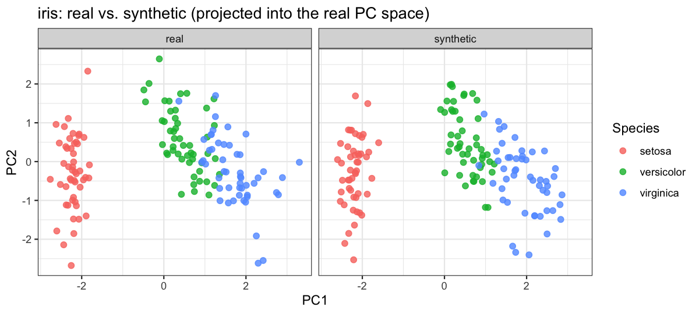

# synthetica

**synthetica** generates privacy-preserving synthetic copies of
mixed-type tabular datasets via a Gaussian copula. It reproduces each
variable’s marginal distribution (means, SDs, level frequencies,
missingness) **and** the joint correlation structure of the data –
without ever retaining a real participant row. The marginal of each
quantitative column is stored as a quantile *grid*, never the raw
vector, so synthetic output is safe to share even when the input is real
participant data.

It was built to share realistic-but-synthetic copies of cohort ’omics
datasets (Metabolon, Olink, Nightingale, SomaLogic), but it is
general-purpose and works on any `data.frame` or numeric `matrix`.

## Installation

``` r

# install.packages("remotes")
remotes::install_github("hughesevoanth/synthetica")
```

## Features

| Function | What it does |
|----|----|
| [`simulate_dataset()`](https://hughesevoanth.github.io/synthetica/reference/simulate_dataset.md) | Core Gaussian-copula simulator. Preserves marginals + correlations; baseline simulation, optional phenotype injection, and per-level fitting via `stratify_by`. |
| [`add_batch_effect()`](https://hughesevoanth.github.io/synthetica/reference/add_batch_effect.md) | Adds a synthetic *technical* batch factor (uniform or spike-and-slab per-feature shifts) for stress-testing batch-correction methods. |
| [`add_group_effect()`](https://hughesevoanth.github.io/synthetica/reference/add_group_effect.md) | Adds a designed *nominal* grouping factor whose levels perturb features in their own directions – explicit (named list) or generative (spike-slab per level, scales to ’omics widths). |
| [`simulate_longitudinal()`](https://hughesevoanth.github.io/synthetica/reference/simulate_longitudinal.md) | Repeated-measures / panel data. Name an `id` and a `time` column; handles ChickWeight-style growth, before/after RCTs, and crossover trials. |

| Capability | Notes |
|----|----|
| Mixed column types | quantitative, whole-number **integer**, binary, categorical factors |
| Integer fidelity | whole-number columns stay integer (exact support for low-cardinality, quantile grid + rounding otherwise) |
| Discrete correlation fidelity | thresholded-normal recovery: tetrachoric / biserial (binary) and polychoric / polyserial (ordinal) |
| Missing data | reproduces the missingness *pattern* via a second Gaussian copula on the NA-indicator matrix |
| Privacy guardrails | quantile-grid marginals, rare-level collapse, near-constant / high-missing column drops |
| Phenotype injection | inject continuous, binary, or ordinal-categorical traits correlated with chosen features |
| Designed structure | technical batch effects and biological group effects as separable post-processors |

## Quick start

Any mixed-type `data.frame` works – numeric, binary, factor, with or
without `NA`s. Here we synthesise the classic `iris` dataset. Because
the three species form well-separated clusters, we fit a **separate
copula per species** with `stratify_by` so the within-species
correlation structure is preserved.

``` r

library(synthetica)

syn <- simulate_dataset(iris, n = nrow(iris), seed = 42,
                        stratify_by = "Species", verbose = FALSE)

head(syn$data)
#>   Sepal.Length Sepal.Width Petal.Length Petal.Width Species
#> 1     4.900000    3.000000     1.400000         0.2  setosa
#> 2     5.000000    3.300000     1.600000         0.2  setosa
#> 3     5.086181    3.284624     1.500000         0.2  setosa
#> 4     5.400000    3.800000     1.500000         0.2  setosa
#> 5     5.366146    3.102106     1.400000         0.2  setosa
#> 6     5.000000    3.243516     1.243057         0.1  setosa
```

The synthetic copy mirrors the input’s column types (including the
`Species` factor) and per-group marginals, while leaking no real rows.

## Real vs. synthetic structure

Projecting the synthetic measurements into the **real**
principal-component space shows the synthetic data occupies the same
manifold – the three species clusters are reproduced, not just the
overall spread.

``` r

library(ggplot2)

num <- c("Sepal.Length", "Sepal.Width", "Petal.Length", "Petal.Width")
pca <- prcomp(iris[num], scale. = TRUE)

scores <- rbind(
  data.frame(predict(pca, iris[num]),     Species = iris$Species,     source = "real"),
  data.frame(predict(pca, syn$data[num]), Species = syn$data$Species, source = "synthetic")
)

ggplot(scores, aes(PC1, PC2, colour = Species)) +
  geom_point(alpha = 0.8, size = 2) +
  facet_wrap(~ source) +
  labs(title = "iris: real vs. synthetic (projected into the real PC space)") +
  theme_bw()
```



## Learn more

- [`vignette("intro", package = "synthetica")`](https://hughesevoanth.github.io/synthetica/articles/intro.md)
  – the full guided tour (iris + a realistic Olink NPX proteomics
  example).
- [`?simulate_dataset`](https://hughesevoanth.github.io/synthetica/reference/simulate_dataset.md)
  – the privacy posture, phenotype injection, and `stratify_by` are
  documented in detail.

## Privacy posture

The defaults are chosen so that output is safe to share even when the
input is real participant data: a minimum cell size of 10, dropping
columns above 90% missingness, near-constant column removal, and a
128-knot quantile grid for every quantitative marginal. See
[`?simulate_dataset`](https://hughesevoanth.github.io/synthetica/reference/simulate_dataset.md)
for the full set of `privacy` knobs.

## License

MIT (c) David A. Hughes. See `LICENSE`.
